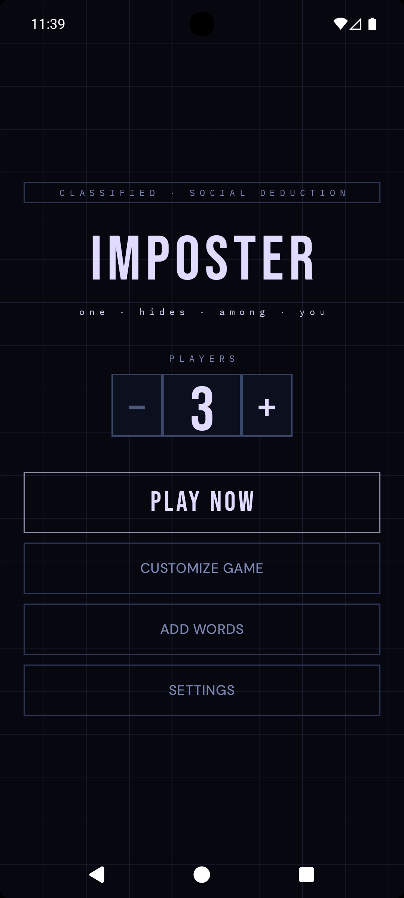
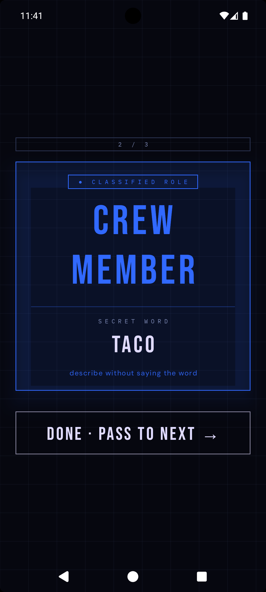
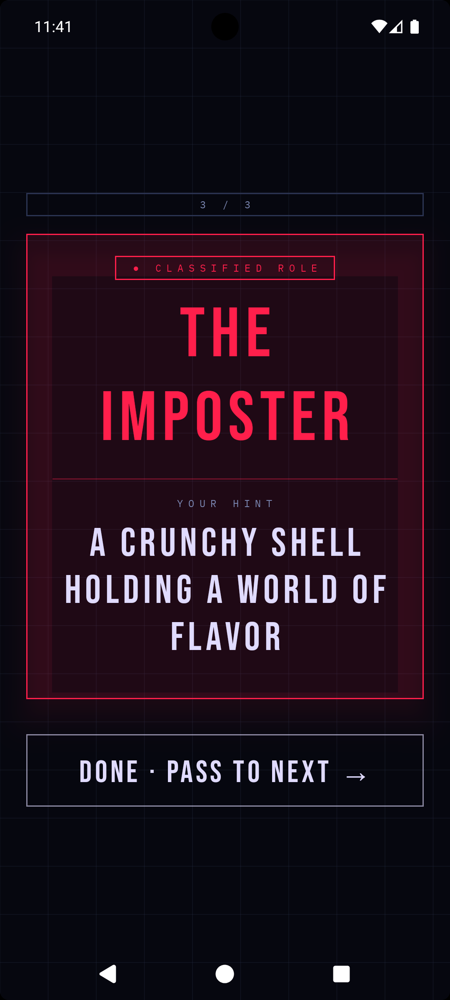
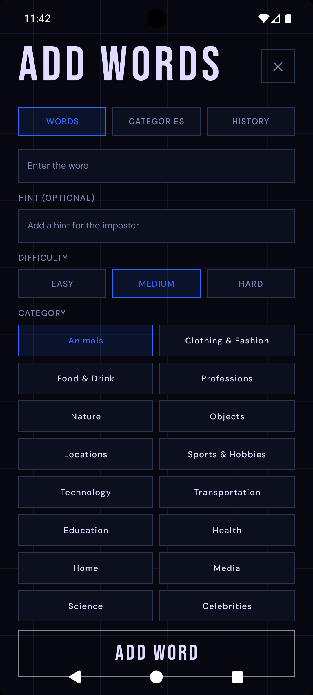

# Imposter

Imposter is a Compose Multiplatform party game designed for local multiplayer. Players must use wit and deception to identify the imposter among them, or stay hidden if they are the one.

## Screenshots

|  |  |  |  |
|:--------------------------------------------------------------:|:----------------------------------------------------------------:|:--------------------------------------------------------------:|:----------------------------------------------------------------------:|

## Development

### Android
- Open in Android Studio and run the `androidApp` configuration.
- Build APK: `./gradlew :androidApp:assembleDebug`

### iOS
- Open `iosApp/iosApp.xcworkspace` in Xcode.
- Requires macOS with Xcode installed.
